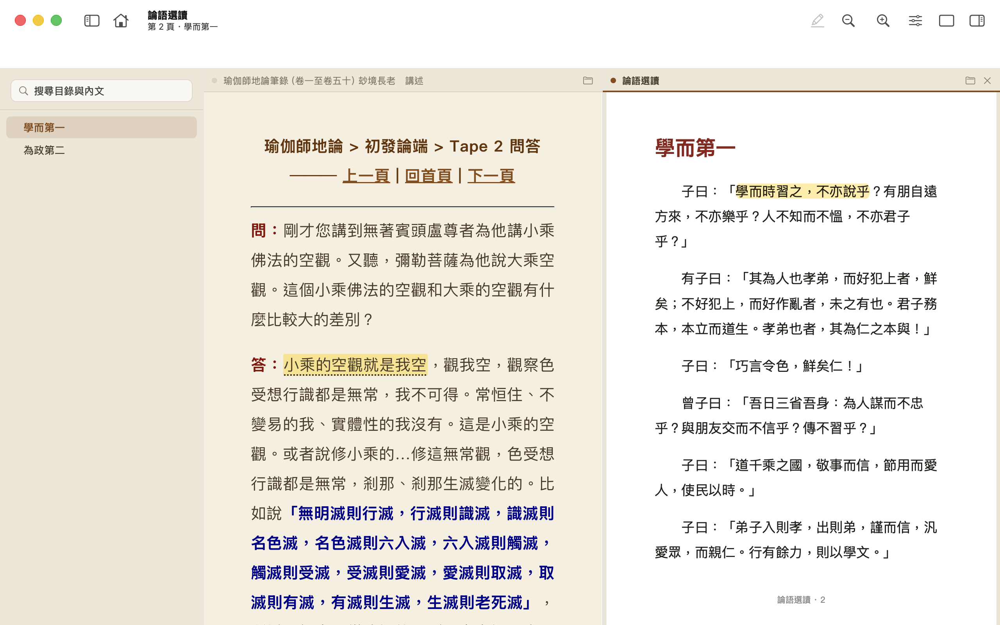

<p align="center">
  
</p>

<h1 align="center">閱讀器 - PDF &amp; CHM</h1>

<p align="center">
  macOS 上的 PDF 與 CHM 閱讀器：螢光標記、筆記、全文搜尋與並排閱讀，正確顯示繁體中文舊檔。<br>
  A macOS reader for PDF and CHM e-books: highlights, notes, full-text search and side-by-side reading, built for Traditional Chinese.
</p>

<p align="center">
  <a href="https://sunmoon-idegu.github.io/chm-reader/">網站 Website</a> ·
  <a href="https://sunmoon-idegu.github.io/chm-reader/privacy.html">隱私權政策 Privacy</a> ·
  <a href="https://github.com/sunmoon-idegu/chm-reader/issues">回報問題 Issues</a>
</p>




## 功能

- **正確顯示繁體中文**：依書中語系自動辨識 Big5 / CP950、HKSCS、GB18030 等舊編碼，不再出現亂碼。
- **目錄側邊欄**：依章節瀏覽，自動標示目前位置；沒有目錄檔的書會依頁面標題自動整理。
- **便利貼**：按工具列的便利貼（⌥⌘N），再點頁面任一處，就能在那裡貼上筆記。
- **全文搜尋**：⌘F 搜尋整本書的內文，結果依頁面列出並標示上下文，點一下就跳到該處。
- **螢光標記與筆記**：選字後從浮出的工具列複製、螢光標記或加筆記（⌥⌘H），點螢光文字即可在右側筆記欄寫筆記，自動儲存，⌫ 刪除、⌘Z 復原；可看本頁或全書筆記，並匯出 Markdown。
- **舒適排版**：蘋方、宋體、楷體；字級（⌘= / ⌘-）、行高、段距、版面寬度；白、米黃、護眼綠、夜間或自訂背景。
- **分頁與分割畫面**：⌘T 開新分頁；⌘\\ 在同一分頁並排閱讀兩本書（或同一本書的兩處），可各自開啟 CHM 或 PDF。
- **PDF**：同樣的目錄、螢光標記、筆記與分頁，目錄取自 PDF 書籤；可縮放，原始檔案不會被修改。
- **隱私**：檔案與筆記只存在你的 Mac，不收集任何資料。

## Features

- Reads legacy Chinese CHMs correctly: Big5/CP950, HKSCS and GB18030 are detected from the book's language ID and page charset.
- Table-of-contents sidebar; books without a `.hhc` get a TOC built from their internal topic tables.
- Sticky notes (⌥⌘N): click the tool, then anywhere on the page.
- Full-text search (⌘F) across the whole book, with snippets; click a result to jump to the match.
- Highlights (⌥⌘H) with a notes panel: per-page or whole-book view, autosave, Markdown export.
- Typography controls: font, size, line height, paragraph spacing, page width, and themes including night mode.
- PDF support: outline sidebar, highlights and notes, zoom; the PDF file itself is never modified.
- Split view (⌘\\): two books side by side in one tab; native macOS tabs; sandboxed, no data collection.

## 系統需求 Requirements

macOS 14 Sonoma 或以上 · macOS 14 Sonoma or later

## 從原始碼建置 Building from source

需要 Xcode 26 與 [XcodeGen](https://github.com/yonaskolb/XcodeGen)（`brew install xcodegen`）。

```sh
swift test                   # 單元測試 unit tests
scripts/build-app.sh         # → build/CHM Reader.app
open "build/CHM Reader.app"
```

`CHMReader.xcodeproj` 由 `project.yml` 產生（`xcodegen generate`），不納入版本控制。
簽章使用的開發團隊設定在 `project.yml`，自行建置時請改成你自己的 Team ID。

The Xcode project is generated from `project.yml`; set `DEVELOPMENT_TEAM` to your own team to build.

## 專案結構 Project layout

| 路徑 Path | 內容 Contents |
|---|---|
| `Sources/CCHMLib` | CHMLib 0.40（C，未修改），解壓縮 CHM / LZX |
| `Sources/CHMKit` | CHM 讀取、目錄解析、文字編碼偵測 |
| `Sources/CHMReader` | SwiftUI + AppKit App 本體（WKWebView 閱讀、筆記、排版） |
| `Tests/CHMKitTests` | 單元測試 |
| `docs/` | GitHub Pages 網站（支援頁、隱私權政策） |
| `dev-docs/` | 技術選型與上架說明 |
| `app-store-asset/` | App Store 文案、截圖、圖示 |

## 授權 License

本專案原始碼採 [MIT 授權](LICENSE)，第三方程式與品牌說明見 [NOTICE](NOTICE)。App 名稱「閱讀器 - PDF & CHM」、圖示與 App Store 素材不在授權範圍內，請勿用於其他發佈的 App。
This project's source code is under the [MIT License](LICENSE). The app name, icon and App Store assets are not licensed for reuse in other distributed apps.

本 App 使用 [CHMLib](https://github.com/jedwing/CHMLib)（© Jed Wing），採 GNU LGPL 2.1 授權，
以未經修改、可替換的動態函式庫 `CCHMLib.framework` 隨附；授權全文見 `Sources/CCHMLib/COPYING`。

This app uses [CHMLib](https://github.com/jedwing/CHMLib) © Jed Wing under the GNU LGPL 2.1, shipped unmodified
as the replaceable dynamic library `CCHMLib.framework`. See `Sources/CCHMLib/COPYING`.

© 2026 Yuming Lu
